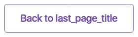

#React Router Historian
> Keeps a record of past locations in react-router (v4.x) apps. This is useful when you for example need a contextual back button:



##Requirements

This plugin is written for [React Router 3.X](https://github.com/ReactTraining/react-router/tree/v3/)

##Installation

[Yarn](https://yarnpkg.com/): `$ yarn add react-router-historian`

[NPM](https://www.npmjs.com/): `$ npm i reaction-router-historian -S`

##Usage and Example

You first need to wrap your app with the HistorianProvider which listens to React Router changes:

```javascript
import { render } from 'react-dom';
import { BrowserRouter as Router } from 'react-router-dom';
import { Historian } from 'react-router-historian';

const App = () => (
	<Router>
		<Historian>
			// ...
		</Historian>
	</Router>
);

render(<App />, document.getElementById('app'));
```

Next, you wrap the components that read and edit (see below) history with the withHistorian HOC:

```javascript
import { React } from 'react';
import { withHistorian } from 'react-router-historian';

class MyComponent extends React.Component {

	componentWillReceiveProps(props) {
		props.updateCurrentLocation({ title: 'MyComponentTitle' });
	}
	
}

export withHistorian(MyComponent);

class MyOtherComponent extends React.Component {

	backFunc() {
		// ...
	}

	render() {
		const lastPage = this.props.getLastLocation();
		
		return (
			<div>
				<button onClick={backFunc}>Back to {lastPage.title}</button>
			</div>
		);
	}
	
}

export withHistorian(MyOtherComponent);

```

##Component functions

These functions are made available via props to the components wrapped with `withHistorian`:

###getCurrentLocation():Object

###getLastLocation():Object

###updateCurrentLocation(location)

##Thanks

React Router Historian is heavily inspired by [react-router-last-location](https://github.com/hinok/react-router-last-location) by [Dawid Karabin](https://github.com/hinok)
